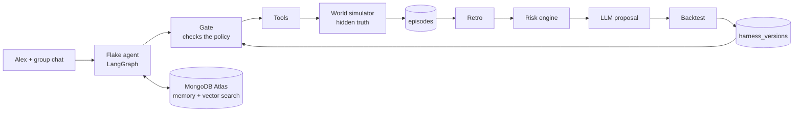
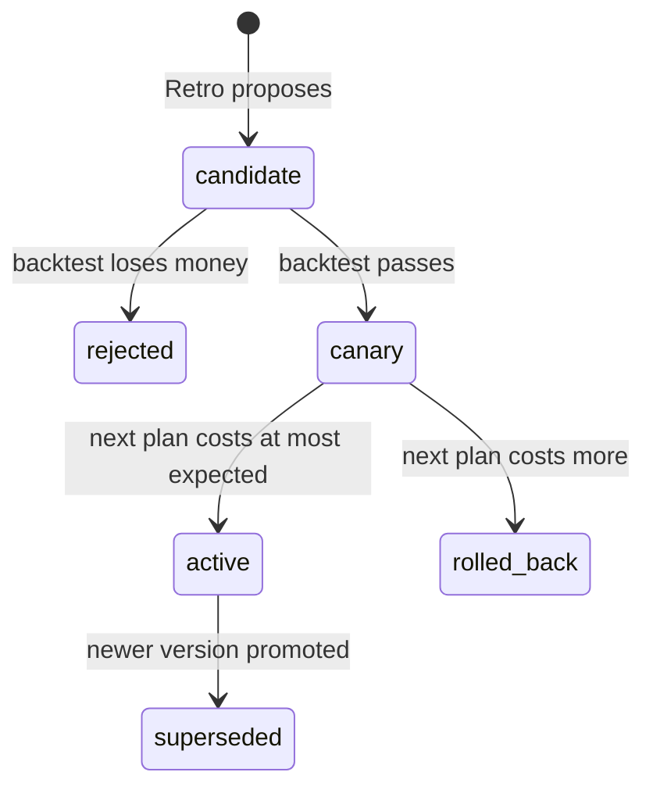

# Flake

**Every group chat has a Sam.** Flake is the friend who plans things for the group and learns who actually shows up.

Underneath it is a harness that rewrites its own rules after every plan, using the same math an insurer uses to price a policy. It starts on probation, earns the right to spend the group's money, and every version of its policy is stored, backtested, canaried and rollable in MongoDB Atlas.

## How it works

Flake is two loops sharing one database.

- **The plan loop.** The agent reads memory, decides, and calls tools to propose a plan, collect RSVPs, book and request money. Every tool call passes through a **gate** that enforces the current policy. The gate can allow the call, modify it (for example, rewrite a non-refundable booking to refundable for someone who keeps bailing), ask the organizer, or deny it. Each decision is written to an append-only audit log.
- **The Retro.** After outcomes land, a risk engine recomputes each friend's chance of bailing or paying late (Beta-Binomial, with credibility). An LLM words a policy proposal, anchored on a deterministic expected-loss suggestion. A backtest replays the proposal over past plans, and any rule that would have cost money is dropped. Survivors ship as a new policy version.



The arrow from `harness_versions` back into the gate is the recursion: what the Retro learns becomes the rules the next plan runs under.

### A new policy is a deploy

A new version runs as a **canary** on the next plan. If that plan costs no more than the old policy was expected to cost, it is promoted. If it costs more, it is rolled back and the previous version stays active.



A **constitution** sets hard floors on the guardrails (exposure caps, minimum confidence). Every proposal is clamped to them, so the policy can rewrite its rules but not the floors, and it cannot skip the backtest.

## Try it

You need Python 3.13+, [uv](https://docs.astral.sh/uv/), a MongoDB Atlas cluster, and API keys for OpenRouter and OpenAI (embeddings).

```sh
cp .env.example .env        # fill in MONGODB_URI, OPENROUTER_API_KEY, OPENAI_API_KEY, ...
uv sync
uv run flake seed           # group, five past plans, v1 policy, first risk table
uv run python scripts/create_indexes.py
sh scripts/demo.sh          # the full demo; resets the database first
```

| Command | What it does |
|---|---|
| `flake seed` | Load the group, past plans and the v1 policy |
| `flake plan "<brief>"` | Run the agent on a new plan |
| `flake tick 7` | Let time pass: resolve booked plans and judge any canary |
| `flake retro` | Run the Retro: risk table, backtest, new version |
| `flake retro --reckless` | Feed the Retro a bad proposal to show the backtest veto |
| `flake versions` | Every policy version with its status, caps and backtest result |
| `flake diff v1 v2` | What changed between two versions |
| `flake rollback` | Roll the active version back to its parent |
| `flake audit <plan_id>` | Every gate decision for a plan |

`scripts/demo.sh` runs these in order: reset, show v1 on probation, run a plan, resolve it, run the Retro (v2 becomes a canary), diff v1 and v2, run a second plan under v2, resolve it (v2 is promoted), then try the reckless proposal (v3 is rejected).

## Visual demo

A presenter-controlled web demo runs the same script beat by beat: a WhatsApp-style group chat on the left, a live diagram of the two loops on the right, an activity feed underneath, and clickable approvals wherever the gate would ask Alex.

```sh
cd frontend && npm install && npm run build && cd ..   # the UI, once (Node 22)
uv run flake-demo                                      # http://127.0.0.1:8000
```

Press **Next Beat**. The first beat resets the demo database, then the beats follow the presentation table: Taco Tuesday, Advance 7 days, Run Retro, Compare policies, Beach Weekend, Advance / evaluate, Reckless Retro. **Reset Demo** cancels whatever is running, releases any approval, clears the demo documents (collections and vector indexes stay), reseeds history and v1, and gives the browser a new session. Refreshing the browser rebuilds the view from the server's event journal; restarting the server needs a fresh reset.

- **Database.** The demo uses its own database, `${MONGODB_DB}_demo` by default (override with `FLAKE_DEMO_DB` or `--db`), with the same Atlas credentials. Its vector indexes are created on first start and on reset, with a bounded wait; until they are queryable, searches fall back to recency and the feed says so. Small Atlas tiers allow **three search indexes per cluster**: the CLI database uses two, so the demo database gets `episodes_vec` (similar plans) and its notes store runs without a vector index (the feed labels note lookups as a fallback). To give the demo both, drop the `flake.notes` index in Atlas or run `uv run flake-demo --db flake`.
- **Model calls.** The LLM cache is shared with the CLI (`.llm_cache.sqlite`), so a rehearsed run replays; every model turn in the feed is labelled `cache hit` or `fresh call`, every retrieval `$vectorSearch` or `vector-search fallback`, and a Retro whose model call failed says `deterministic fallback`.
- **Approvals.** When `ask_organizer` runs, the question appears in the chat with Approve / Decline and the tool call waits for the click. A second click on the same request is ignored. The CLI (`flake plan`) keeps its scripted "yes".
- **Offline rehearsal.** `uv run flake-demo --fake` needs no keys or network: an in-memory database and a scripted model that books everyone non-refundable and then does what the gate tells it. The gate, risk maths, backtest and canary run for real.
- **Pace.** Cached model calls would finish a beat in a second, so the worker holds each step on screen for a few seconds before moving on: the node stays lit, the edge animates, the row lands, then the next step runs. At Normal a plan beat takes about two minutes, the Retro about half a minute. The top bar's Pace control (Slow / Normal / Fast / Instant) scales this live, `--pace` or `FLAKE_DEMO_PACE` sets the start value, and a reset never waits for a pause.
- **Frontend development.** `uv run flake-demo` in one terminal, `cd frontend && npm run dev` in another (Vite on :5173 proxies `/api` to :8000).

HTTP surface: `GET /api/state` (beat, pending approvals, display data, event cursor, the journal), `GET /api/events` (Server-Sent Events; `?since=&session=` or `Last-Event-ID` resumes), `POST /api/next`, `POST /api/approvals/{id}` with `{"decision": "approve"|"decline"}`, `POST /api/reset`.

### Tests

```sh
uv run pytest                 # unit tests, plus the whole script driven through the coordinator with a scripted model
cd frontend && npm test       # diagram/chat event folds, Node's built-in test runner
cd frontend && npm run build && npx playwright install chromium && npm run test:e2e   # desktop and narrow layouts against --fake
```

If Chromium refuses to start for want of `libnss3`/`libasound2` and you cannot install packages, download them (`apt-get download libnss3 libnspr4 libasound2t64`), extract with `dpkg -x`, and run the e2e tests with `PW_CHROMIUM_LD_LIBRARY_PATH=<dir>/usr/lib/x86_64-linux-gnu`.

## Data model

Everything lives in one MongoDB database, so the agent's working memory and its long-term memory sit side by side.

| Collection | Holds |
|---|---|
| `episodes` | Each plan: RSVPs, booking, money requests, approvals, outcomes, a summary and its 1536-dim embedding for vector search |
| `harness_versions` | Every policy version: rules, guardrails, tool permissions, context policy, backtest result, canary result, status |
| `risk_profiles` | Per-friend Beta-Binomial estimates for bailing and paying late, plus a Flake Score (850 - 550 x P(flake)) |
| `audit_log` | One document per gate decision: tool, requested and final arguments, decision, the rule that fired |
| `groups`, `chat_log`, `notes` | The group, its chat, and per-person facts searched by meaning |
| `checkpoints`, `checkpoint_writes` | The LangGraph agent's working state, saved after every node |

The full field-level contract is in [src/flake/schema.md](src/flake/schema.md).

## What is scripted in the demo

So that the demo repeats identically, some inputs are fixed on purpose:

- **Scripted history.** The five past plans the group organized before Flake are typed in, not generated ([src/flake/world/history.py](src/flake/world/history.py)). Every number the Retro produces comes from them.
- **Seeded randomness.** The simulator draws from a fixed seed (`DEMO_SEED`).
- **Scripted Sam.** In the two live plans, Sam bails on cue instead of by dice roll.
- **A reckless proposal.** `flake retro --reckless` feeds the Retro a deliberately bad proposal (no rules, caps at the floors). The backtest's negative dollar figure is real; only the proposal is staged.
- **Replayed model calls.** Identical LLM calls are cached on disk (`.llm_cache.sqlite`), so re-running a plan replays the recorded model output instead of calling the API again. The cache is keyed on the exact prompt and model, so changing the policy, the prompt or `LLM_MODEL` produces a fresh call. The gate, the backtest and the canary are plain code and run live every time. For a cold run, delete `.llm_cache.sqlite`, or set `LLM_CACHE=0` to turn the cache off.

## Visual demo (presenter view)

`open demo/index.html` — no build step, no server, no dependencies.

A WhatsApp-style Taco Council chat on the left, the planning and learning loops as a
fixed diagram on the right, and a chronological activity feed with an inspector below it.
**Next Beat** (or space) advances one beat at a time through the same eight beats as the CLI
script; **Reset Demo** starts over. When the gate returns `ask`, the beat pauses and the
presenter clicks Approve or Decline in the chat. Clicking an activity row pins its evidence in
the inspector and highlights its diagram node; **Live** returns to following execution.

The beats are recorded in [demo/script.js](demo/script.js): the figures shown (backtest deltas,
clamp notes, canary expected vs realized cost, Beta posteriors) are the values the real
`harness/` and `risk/` code produces over the seeded history, but this page does **not** call
Python — it is a scripted replay for presenting. Wiring it to the live coordinator is a
separate step.
